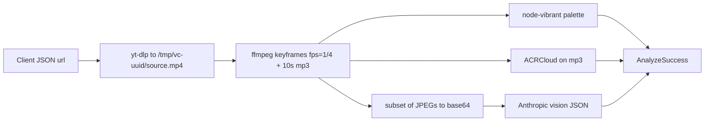

# WhyItSlaps — technical reference

Runtime stack, HTTP APIs, media pipeline, and client state. Root **[README](../README.md)** for onboarding. **[BOTTLENECKS.md](../BOTTLENECKS.md)** for hosting limits.

---

## Stack (high level)

| Layer | Technology |
|-------|------------|
| Framework | Next.js 14 (App Router), React 18 |
| Language | TypeScript (strict) |
| Styling | Tailwind CSS, grain overlay (`app/layout.tsx`, `globals.css`) |
| Video acquisition | **yt-dlp** (CLI) — `lib/download.ts` |
| Transcode / frames / clip-audio strip | **ffmpeg** + **ffprobe** — `lib/frames.ts` |
| Video vision critique | Anthropic Messages API — `lib/claude.ts` |
| Clip soundtrack fingerprint | **ACRCloud** — `lib/music.ts` (used on **video** pipeline only) |
| Music-mode data | **Spotify Web API** — `lib/spotify.ts` |
| Music-mode critique | Anthropic Messages API — `lib/claude-music.ts` |
| Palette | **node-vibrant** — `lib/palette.ts` |
| Edit plan | Anthropic — `app/api/editplan/route.ts` |
| Optional browser assist | Chrome **extension** → `analyze-upload` |

Node deps of note: `@anthropic-ai/sdk`, `node-vibrant`, `uuid`. Video download uses **subprocesses**, not `@distube/ytdl-core` (still in `package.json` but not on these code paths).

---

## User-visible flow

1. **`/`** — `AnalyzeToolPage` + `InputScreen`: **VIDEO** vs **MUSIC** toggle.
2. **VIDEO:** **Analyze** → `/api/analyze` (URL) or extension upload → `/api/analyze-upload`; **Download** → `/api/download` only.
3. **MUSIC:** **Analyze** → `/api/analyze-music` (Spotify track URL JSON).
4. **`/welcome`**, **`/analyze`** → redirect `/`.

Results: **`ResultsScreen`** (video) vs **`MusicResultsScreen`** (music).

---

## VIDEO pipeline (`POST /api/analyze`)

- **Duration / resolution:** `--match-filter "duration <= 60"`, **720p** cap — `lib/download.ts`.
- **Keyframes:** ~every **4s**; vision uses up to **14** frames (`framesToBase64Jpegs(..., 14)` in analyze routes).
- **Workspace:** `/tmp/vc-*` or `vc-upload-*`; wiped after response.

---

## MUSIC pipeline (`POST /api/analyze-music`)

1. Parse **Spotify track ID** from URL (`extractSpotifyTrackId`).
2. **Client-credentials** token; fetch track + **audio features** (`lib/spotify.ts`).
3. **`analyzeMusicWithClaude(track, features)`** → structured JSON per `types/music-analysis.ts`.
4. `maxDuration = 60` on this route (lighter than video).

No ffmpeg/yt-dlp on this path.

---

## HTTP API routes

| Method | Path | Role |
|--------|------|------|
| `POST` | `/api/analyze` | JSON `{ url }` — full **video** pipeline (`maxDuration` 300). |
| `POST` | `/api/analyze-upload` | Multipart **`video`** — same pipeline, no yt-dlp (`max duration` 300). |
| `POST` | `/api/analyze-music` | JSON `{ url }` — Spotify track analysis (`maxDuration` 60). |
| `POST` | `/api/download` | JSON `{ url }` → `video/mp4` (`maxDuration` 300). |
| `POST` | `/api/editplan` | Reference **video** analysis + user clips → edit plan (`maxDuration` 300). |

Long `maxDuration` values require a host that actually honors them (see BOTTLENECKS).

---

## Environment variables

| Variable | Used by |
|----------|---------|
| `ANTHROPIC_API_KEY` | Vision, music critique, edit plan |
| `ANTHROPIC_MODEL` | Defaults in `lib/claude.ts` and `lib/claude-music.ts`; edit plan may use `ANTHROPIC_EDITPLAN_MODEL` |
| `ANTHROPIC_EDITPLAN_MODEL` | Optional — `/api/editplan` only |
| `ACRCLOUD_*` | **Video** path clip fingerprinting — `lib/music.ts` |
| `SPOTIFY_CLIENT_ID`, `SPOTIFY_CLIENT_SECRET` | **Music** mode — `lib/spotify.ts` |

---

## Client persistence

- **Video:** `sessionStorage` `whyitslaps:last-result` — envelope `{ v: 1, result, url }`.
- **Fresh:** `/?fresh=1` clears video cache (and extension handoff key `whyitslaps_result` polling).
- **Music:** in-memory for the session unless extended — no `last-result` envelope for music yet (`AnalyzeToolPage`).

---

## Chrome extension (optional)

`extension/` — IG CDN MP4 capture → `POST .../api/analyze-upload` (configurable base URL).

---

## Key source files

| Area | Files |
|------|--------|
| Entry | `app/page.tsx`, `components/AnalyzeToolPage.tsx`, `components/InputScreen.tsx` |
| Video results | `components/ResultsScreen.tsx`, `components/MusicCard.tsx`, … |
| Music results | `components/MusicResultsScreen.tsx` |
| Types | `types/analysis.ts`, `types/music-analysis.ts`, `types/editplan.ts` |

---

## Loading UX

`LoadingScreen` phases: **`analyze`** (video), **`music`**, **`download`** — rotating copy is illustrative, not step-accurate.
