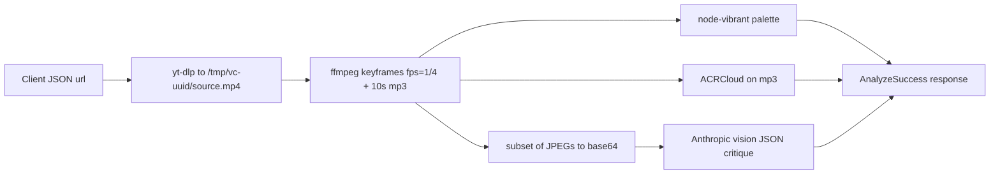

# WhyItSlaps — technical reference

Deep dive into how the app is wired: runtime stack, HTTP APIs, media pipeline, and client state. For setup and env vars, see the root [README](../README.md). For deployment limits (Vercel, Instagram, binaries), see [BOTTLENECKS.md](../BOTTLENECKS.md).

---

## Stack (high level)

| Layer | Technology |
|-------|------------|
| Framework | Next.js 14 (App Router), React 18 |
| Language | TypeScript (strict) |
| Styling | Tailwind CSS, custom grain overlay (`app/layout.tsx` + `globals.css`) |
| Video acquisition | **yt-dlp** (CLI) — `lib/download.ts` |
| Transcode / frames / audio strip | **ffmpeg** + **ffprobe** (CLI) — `lib/frames.ts` |
| Vision critique | Anthropic **Messages API** (images + system prompt) — `lib/claude.ts` |
| Track fingerprinting | **ACRCloud** Identify API — `lib/music.ts` |
| Palette | **node-vibrant** on sampled frame — `lib/palette.ts` |
| Edit plan | Same Anthropic client, separate system prompt — `app/api/editplan/route.ts` |
| Optional browser assist | Chrome **extension** (`extension/`) posts captured CDN MP4 to analyze-upload |

Node dependencies of note: `@anthropic-ai/sdk`, `node-vibrant`, `uuid`. Downloads are implemented with subprocesses, not the `@distube/ytdl-core` package (present in `package.json` but not on the analyze path today).

---

## User-visible flow

1. **Home (`/`)** — `AnalyzeToolPage`: URL input, **Analyze** (full pipeline) or **Download** (fetch capped MP4 only via `/api/download`).
2. **`/welcome`** — Short marketing copy; links to `/` and `/?fresh=1`.
3. **`/analyze`** — Redirects to `/` (legacy URLs).
4. **Results** — `ResultsScreen`: vibe, tags, scores, **MusicCard** (ACR result or empty), palette, cinematography / grade / edit copy, Why It Works, How To Edit Like This, share-to-clipboard, **Edit My Footage** panel.

There is **no separate “music mode” vs “video mode” toggle** in the UI today. **Music** means *identified soundtrack* (when ACRCloud returns a match). A dedicated **music-first** analyzer (paste a track URL, no video pipeline) is **not implemented**; it remains roadmap material (see [CONCEPT.md](../CONCEPT.md)).

---

## Analyze pipeline (URL)

End-to-end behavior for `POST /api/analyze`:

Details:

- **Duration / size:** yt-dlp uses `--match-filter "duration <= 60"` and format cap **720p** (`lib/download.ts`).
- **Keyframes:** One JPEG every **4 seconds** (`ffmpeg` `-vf fps=1/4`), stored under `workDir/frames/`.
- **Vision batch:** `framesToBase64Jpegs` subsamples to up to **14** frames (`app/api/analyze/route.ts`) / **16** in helper default (`lib/frames.ts`) — callers pass the limit explicitly in analyze routes.
- **Audio for music ID:** First **10 seconds** to `audio.mp3`, sent to ACRCloud. Failure → `music: null`; analysis continues.
- **Workspace:** `/tmp/vc-{uuid}` deleted in `finally` after the response.

Upload path (`POST /api/analyze-upload`) skips yt-dlp: multipart field **`video`** (file), max **100 MB**, then the same extract → palette → music → vision steps.

---

## HTTP API routes

| Method | Path | Role |
|--------|------|------|
| `POST` | `/api/analyze` | JSON `{ url }` → full analysis (download + pipeline). |
| `POST` | `/api/analyze-upload` | `multipart/form-data` field **`video`** → same pipeline without yt-dlp. |
| `POST` | `/api/download` | JSON `{ url }` → `video/mp4` attachment (yt-dlp + optional transcode for QuickTime-friendly output — see `lib/transcodeDownload.ts`). |
| `POST` | `/api/editplan` | JSON with reference analysis + user clip list + target duration → structured edit plan (`types/editplan.ts`). |

All four routes use `export const runtime = "nodejs"` and `maxDuration = 300` where defined — **hosting must actually allow** that ceiling (see BOTTLENECKS).

---

## Environment variables

| Variable | Used by |
|----------|---------|
| `ANTHROPIC_API_KEY` | Vision + edit plan |
| `ANTHROPIC_MODEL` | Vision (`lib/claude.ts`); edit plan falls back here if `ANTHROPIC_EDITPLAN_MODEL` unset |
| `ANTHROPIC_EDITPLAN_MODEL` | Optional override **only** for `/api/editplan` |
| `ACRCLOUD_HOST`, `ACRCLOUD_ACCESS_KEY`, `ACRCLOUD_ACCESS_SECRET` | `lib/music.ts` |

---

## Client persistence

- **Last result cache:** `sessionStorage` key `whyitslaps:last-result` — envelope `{ v: 1, result, url }` (`AnalyzeToolPage`).
- **Fresh session:** `/?fresh=1` or `/?new=1` clears cache and normalizes the URL.
- **Extension handoff:** Extension can write `whyitslaps_result` in `sessionStorage`; the app polls briefly on load to pick it up.

---

## Chrome extension (optional)

Path: `extension/` (Manifest v3-style background + content scripts).

- Observes Instagram CDN requests and stores a candidate **MP4 URL** per tab.
- Can **fetch** that URL (with Instagram-oriented headers) and **`POST`** bytes to `analyze-upload` (default `http://localhost:3000/api/analyze-upload`; configurable via message `analyzeUploadUrl`).
- Useful when pasting a Reel URL through the server fails but the browser already has a direct media URL.

---

## Key source files

| Area | Files |
|------|--------|
| Entry UI | `app/page.tsx`, `components/AnalyzeToolPage.tsx`, `components/InputScreen.tsx` |
| Results | `components/ResultsScreen.tsx`, `components/MusicCard.tsx`, `components/EditMyFootagePanel.tsx`, … |
| Types | `types/analysis.ts`, `types/editplan.ts` |
| Share text | `lib/share.ts` |
| Download helper | `lib/download.ts`, `lib/clientDownload.ts` |

---

## Loading UX

`LoadingScreen` rotates copy for **analyze** vs **download** phases (`components/LoadingScreen.tsx`). Analyze messages are illustrative only; they do not reflect exact sub-step timing (download, ffmpeg, ACR, vision run in sequence on the server).
